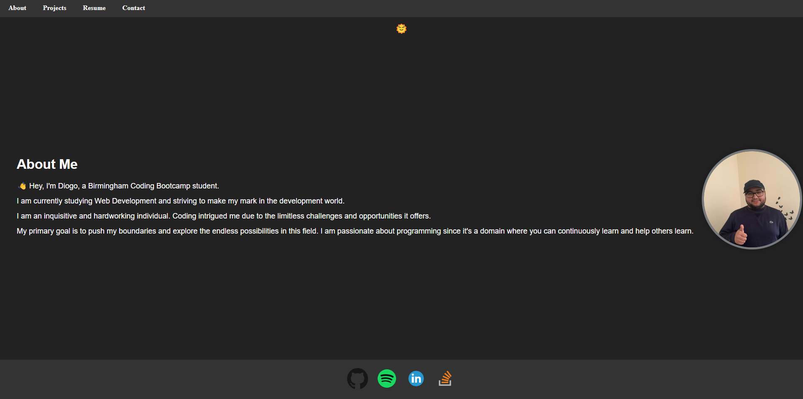

# React Portfolio

## User Story

```md
AS AN employer looking for candidates with experience building single-page applications
I WANT to view a potential employee's deployed React portfolio of work samples
SO THAT I can assess whether they're a good candidate for an open position
```

## Acceptance Criteria

```md
GIVEN a single-page application portfolio for a web developer
WHEN I load the portfolio
THEN I am presented with a page containing a header, a section for content, and a footer
WHEN I view the header
THEN I am presented with the developer's name and navigation with titles corresponding to different sections of the portfolio
WHEN I view the navigation titles
THEN I am presented with the titles About Me, Portfolio, Contact, and Resume, and the title corresponding to the current section is highlighted
WHEN I click on a navigation title
THEN I am presented with the corresponding section below the navigation without the page reloading and that title is highlighted
WHEN I load the portfolio the first time
THEN the About Me title and section are selected by default
WHEN I am presented with the About Me section
THEN I see a recent photo or avatar of the developer and a short bio about them
WHEN I am presented with the Portfolio section
THEN I see titled images of six of the developer’s applications with links to both the deployed applications and the corresponding GitHub repositories
WHEN I am presented with the Contact section
THEN I see a contact form with fields for a name, an email address, and a message
WHEN I move my cursor out of one of the form fields without entering text
THEN I receive a notification that this field is required
WHEN I enter text into the email address field
THEN I receive a notification if I have entered an invalid email address
WHEN I am presented with the Resume section
THEN I see a link to a downloadable resume and a list of the developer’s proficiencies
WHEN I view the footer
THEN I am presented with text or icon links to the developer’s GitHub and LinkedIn profiles, and their profile on a third platform (Stack Overflow, Twitter)
```

## Description

This project consists in a React Portfolio that will allow me to display somne information about me like projects, small about me section, resume and a contact form.

There was no major challenges for me during this project was definitely getting the creativity and know what i wanted to do or achieve with it, i think even with it done i still want to do so much more stuff but i still dont know what exactly.

This challenge helped me a lot because it made me create something i will use for the future in my Developer Career, this challenge also helped me with other things that i will be listing bellow.

- Better use of React
- Higher understanding of GitHub Pages.
- Higher understanding of css animations

## Table of Contents

- [Installation](#installation)
- [Usage](#usage)
- [Tests](#tests)
- [License](#license)
- [Questions](#questions)

## Installation

To install the necessary dependencies, run the following command:

```
npm i
```

## Usage

To use this repository is pretty simple. You will have to clone the repo , and soon as you clone it and open it, you will need to open your terminal and run the following command (npm i). After installing everything you will need to run this following command in your terminal run (npm run start). After running this command you will see your localhost was made and you should be able to access your localhost and open the portfolio. Or you can use the github deployed application instead of the localhost. Also you can switch between dark and light mode by clicking in the sun emoji on top.



Deployed Application: https://diogos77.github.io/React-Portfolio

## Tests

I will be listing the tests i have done.

```
Tested - Tested Dark and Light Mode
Tested - Tested Opening Projects
Tested - Tested Downloading Resume
Tested - Tested Contact Form
```

## License


This project is licensed under the MIT license.

## Questions

For any questions or inquiries, feel free to reach out to me:

- GitHub: [DiogoS77](https://github.com/DiogoS77)
- Email: diogo.messi.18@hotmail.com

Deployed Application: https://diogos77.github.io/React-Portfolio
